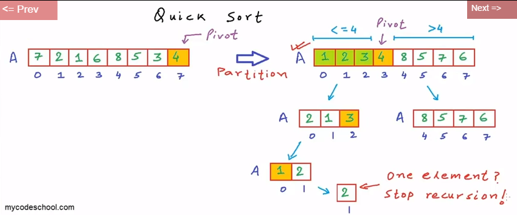
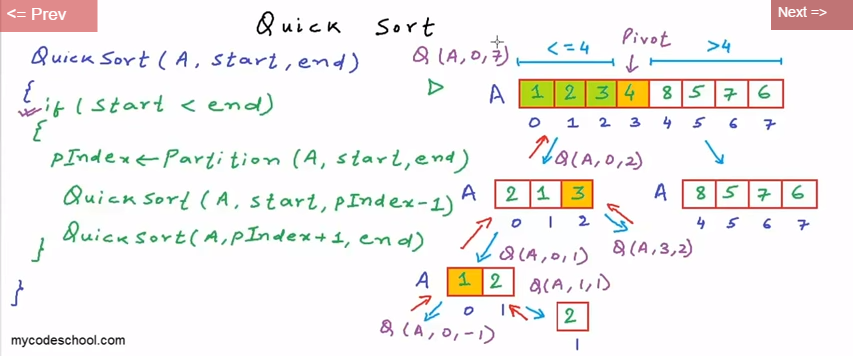

Welcome! 

This is a repository of interview challenges that I have solved, including notes and links to external resources that I used. I'll be coding in Javascript. Enjoy :) 

##Quick Sort
Quick Sort is a sorting algorithm that 
* has an O(nLogn) average case running time
* has O(n^2) worst case running time
* sorts in place i.e. constant space 

###How it works:
QuickSort on a very high level, consists of two steps:

1. partitioning the array:
separates an array into two groups: greater than and less than pivot value. Let's say we choose the last number in our array to be our pivot value. we need to organize the array such that all the numbers less than the pivot value will be on the left side. We can use a 'wall' to separate our left from our right side of the array. A wall is going to be the index that seperates less than/ greater than the pivot. Everything less than the pivot will be shoved to the left of the wall. The values at the wall and beyond are greater than (or equal to) the pivot. Once we're done separating it into two groups, our last step is to swap the pivot with the value at the wall. Now let's return the index of the pivot.

2. Now that we know the pivotPosition, let's call QuickSort on both sides of the pivot:   
calling QuickSort on the left side of the pivot
calling QuickSort on the right side of the pivot

Eventually, we'll be calling QuickSort on a smaller and smaller subarray until our end > start :) So let's only run those partitioning and recursive calls if we're given a valid subarray. 

For more information, check out [mycodeschool's video](https://www.youtube.com/watch?v=COk73cpQbFQ)! Here's my actual [ implementation](/quickSort.js) in Javascript.
